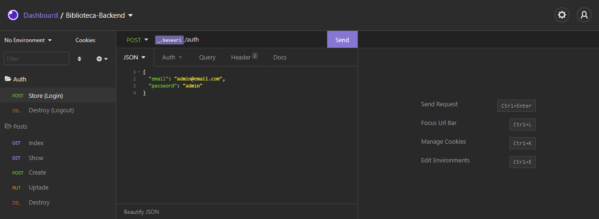

<br />
<p align="center">
    

  <h3 align="center">Biblioteca by <a href="https://github.com/brunoandreotti">Bruno</a></h3>
 <br />
  <p align="center">
     Sistema de gerenciamento de biblioteca
      <p align="center">
  <a href="#sobre"> Sobre </a> |
  <a href="#rotas-da-aplicação"> Rotas da aplicação </a> |
  <a href="#rodando-o-projeto"> Rodando o projeto </a> |
  <a href="#tecnologias-utilizadas"> Tecnologias utilizadas </a> |
  <a href="#implementações"> Implementações </a>      
       <br />
    <br />
    <h1 align="center">
    
 </h1>
  </p>
</p>


# Sobre
O objetivo do projeto foi criar o backend para um sistema de gerenciamento de uma biblioteca, com a finalidade de colocar em prática os conhecimentos que adquiri até o momento!


# Rotas da aplicação:
<b>[POST] </b> /auth : A rota deverá fazer o login do usuário e retornar um bearer token.<br><br>
<b>[DELETE] </b> /auth : A rota deverá deletar o usuário baseado em seu bearer token.<br><br>
<b>[GET] </b> /obras : A rota deverá listar todas as obras cadastradas.<br><br>
<b>[GET] </b> /obras/:id : A rota deverá listar as obras referente ao ID informado.<br><br>
<b>[POST] </b> /obras :  A rota deverá receber titulo, editora, imagem, e autores dentro do corpo da requisição.<br>Por exemplo:<br>
```javascript
{
	"título": "Livro 1",
	"editora": "Editora 1",
	"imagem": "Link da Imagem do Livro 1",
	"autores": "Autor 1, Autor 2, Autor 3"
}
```
<b>[PUT] </b> /obras/:id : A rota deverá atualizar as informações de título, editora, imagem e autores da obra com o ID presente nos parâmetros da rota.<br><br>
<b>[DELETE] </b> /obras/:id : A rota deverá deletar a obra com o ID presente nos parâmetros da rota.<br>

# Implementações:

### Autenticação
Foi adicionada a rota '/auth', responsável pela autenticatição (login/logout). <br>
A rota '/obras' foi protegida, permitindo somente ser acessada por usuários autenticados. <br>
Esse projeto possui dois níveis usuários possíveis: <br>
Normal (email: nomal@email.com, password: normal): Possui acesso às rotas de listagem. <br>
Admin (email: admin@email.com, password: admin): Possui acesso a todas as rotas. <br><br>
O usuário deve ser enviado no corpo da requisição como um JSON. Exemplo: <br>
```javascript
{
  "email": "admin@email.com",
  "password": "admin"
}
```
<br>

Após a autenticação, as requisições terão que conter um header do tipo 'Authorization' com o valor 'bearer bearer-token-gerado-na-autenticação':

<h1 align="center">
    
 </h1>
 
 ### Validação de dados
 Foi adicionada as seguintes validações para os dados recebidos nas requisições: <br>
 <b>[POST] </b> /auth : O campo "email", deverá ser  um endereço de email.<br><br>
 <b>[POST] </b> /obras : <br>
 O campo 'título' deverá ser uma string e o título deve ser único, não podendo haver dois títulos iguais no banco de dados.<br>
 O campo 'editora' deverá ser uma string. <br>
 O campo 'imagem' deverá ser uma url e a imagem deve ser única, não podendo haver duas imagens com a mesma url no banco de dados. <br>
 O campo 'autores' deverá ser uma string.


# Rodando o projeto:

### Pré-requisitos:
Antes de começar, você precisará instalar em sua máquina as seguintes ferramentas:
[Git](https://git-scm.com), [Node.js](https://nodejs.org/en/), [Docker Compose](https://docs.docker.com/compose/install) e [Insomnia](https://insomnia.rest/download). <br> Além disso, é aconselhável ter um editor como o [VSCode](https://code.visualstudio.com/) para trabalhar com o código!

### Instalando e rodando o projeto:


```bash
# Clone este repositório
$ git clone https://github.com/brunoandreotti/biblioteca-backend

# Acesse a pasta do projeto no terminal
$ cd biblioteca-backend

# Crie um container com MySQL
$ docker-compose up -d

# Instale as dependências do projeto
$ npm install

# Crie a estrutura do banco de dados
$ node ace migration:run

# Carregue os usuários 'Normal' e 'Admin' no banco de dados
$ node ace db:seed

# Inicie o servidor da aplicação
$ npm run dev

# Utilize o Insomnia para realizar as requisições nas rotas

```


# Tecnologias utilizadas: 
<p align="center">
<a href="https://nodejs.org/en/"></a> <a href="https://adonisjs.com"></a> <a href="https://www.typescriptlang.org"></a> <a href="https://insomnia.rest/download"></a> <a href="https://www.docker.com"></a>
</p>


# Devchallenge
O projeto foi feito baseado em um <a href="https://github.com/devchallenge-io/biblioteca-backend">desafio</a> da <a href="https://devchallenge.now.sh/"> DevChallenge</a> !

---
**Desenvolvido  por [Bruno Andreotti](https://github.com/brunoandreotti).** 

