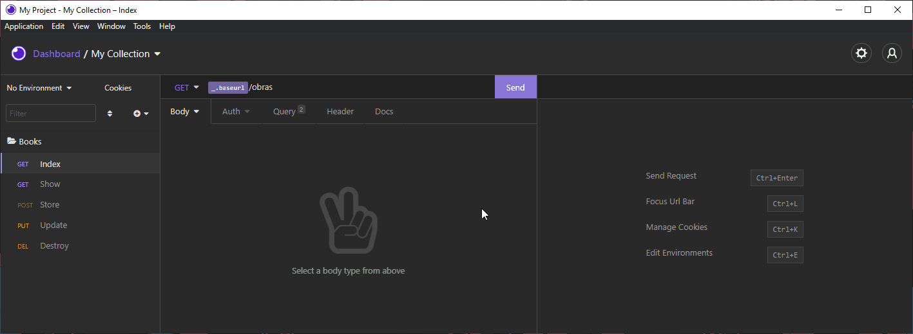

<br />
<p align="center">
    

  <h3 align="center">Biblioteca by <a href="https://github.com/brunoandreotti">Bruno</a></h3>
 <br />
  <p align="center">
     Sistema de gerenciamento de biblioteca
      <p align="center">
  <a href="#sobre"> Sobre </a> |
  <a href="#rotas-da-aplicação"> Rotas da aplicação </a> |
  <a href="#rodando-o-projeto"> Rodando o projeto </a> |
  <a href="#tecnologias-utilizadas"> Tecnologias-utilizadas </a>
       <br />
    <br />
    <h1 align="center">
    
 </h1>
  </p>
</p>


# Sobre
O objeto do projeto foi criar o backend para um sistema de gerenciamento de uma biblioteca, com a finalidade de colocar em prática os conhecimentos que adquiri até o momento!


# Rotas da aplicação:
<b>[GET] </b> /obras : A rota deverá listar todas as obras cadastradas.<br><br>
<b>[GET] </b> /obras/:id : A rota deverá listar a obras referente ao ID informado.<br><br>
<b>[POST] </b> /obras :  A rota deverá receber titulo, editora, imagem, e autores dentro do corpo da requisição.<br>Por exemplo:<br>
```javascript
{
	"título": "Livro 1",
	"editora": "Editora 1",
	"imagem": "Link da Imagem do Livro 1",
	"autores": "Autor 1, Autor 2, Autor 3"
}
```
<b>[PUT] </b> /obras/:id : A rota deverá atualizar as informações de titulo, editora, imagem e autores da obra com o ID presente nos parâmetros da rota.<br><br>
<b>[DELETE] </b> /obras/:id : A rota deverá deletar a obra com o ID presente nos parâmetros da rota.<br>

# Rodando o projeto:

### Pré-requisitos:
Antes de começar, você vai precisar ter instalado em sua máquina as seguintes ferramentas:
[Git](https://git-scm.com), [Node.js](https://nodejs.org/en/), [Docker Compose](https://docs.docker.com/compose/install) e [Insomnia](https://insomnia.rest/download). <br> Além disso, é aconselhável ter um editor como o [VSCode](https://code.visualstudio.com/) para trabalhar com o código!

### Instalando e rodando o projeto:

```bash
# Clone este repositório
$ git clone <https://github.com/brunoandreotti/biblioteca-backend>

# Acesse a pasta do projeto no terminal
$ cd biblioteca-backend

# Crie um container com MySQL
$ docker-compose up -d

# Crie a estrutura do banco de dados
$ node ace migration:run

# Instale as dependências
$ npm install

# Inicie o servidor da aplicação
$ npm run dev

# Utilize o Insomnia para realizar as requisições nas rotas

```


# Tecnologias utilizadas: 
<p align="center">
<a href="https://nodejs.org/en/"></a> <a href="https://adonisjs.com"></a> <a href="https://www.typescriptlang.org"></a> <a href="https://insomnia.rest/download"></a> <a href="https://insomnia.rest/download"></a>
</p>


# Devchallenge
O projeto foi feito baseado em um <a href="https://github.com/devchallenge-io/biblioteca-backend">desafio</a> da <a href="https://devchallenge.now.sh/"> DevChallenge</a> !

---
**Desenvolvido  por [Bruno Andreotti](https://github.com/brunoandreotti).** 

